# UEKRoom

## Informacje ogólne

**UEKRoom** jest hybrydową aplikacją na urządzenia mobilne (iOS oraz Android), która została stworzona przy wykorzystaniu frameworka [Cordova](https://cordova.apache.org) oraz ze wsparciem wizualnym ze strony frameworka [jQuery Mobile](https://jquerymobile.com).

Głównym celem tej aplikacji jest dostarczenie możliwości sprawdzenia **dostępnych** sal wykładowych w podanym **terminie** oraz dla podanej **grupy dziekańskiej** lub **lektoratu**. Możliwości te są skierowane dla studentów, wykładowców oraz pracowników [Uniwersytetu Ekonomicznego w Krakowie](http://uekwww.uek.krakow.pl).

Aplikacja została stworzona w opraciu o **API** dostarczane przez [Koło Naukowe >DEV](http://dev.uek.krakow.pl) działające przy UEK w Krakowie. Wspomniane API jest cześcią większego projektu - **devPlan**, o którym można uzyskać więcej informacji na jego [stronie internetowej](http://dev.uek.krakow.pl). Oczywiscie, API musiało zostać wzbogacone o odpowiednie zapytania do bazy danych, które zwracają wyniki wykorzystywane w aplikacji **UEKRoom**.

**UEKRoom** został stworzony jako projekt zaliczeniowy z przedmiotu _Zaawansowane Aplikacje Internetowe_, a jego twórcami są:

- Maciej Komorowski
- Mateusz Zając

Całość projektu (kod źródłowy oraz dokumentacja) jest dostępna na serwisie **Github** pod linkiem: [https://github.com/cojoj/UEKRoom](https://github.com/cojoj/UEKRoom). Całość objęta jest licencją [MIT](https://github.com/cojoj/UEKRoom/blob/master/LICENSE).

## Podręcznik użytkownika

#### Uruchomienie aplikacji

Uruchomienie aplikacji **UEKRoom** następuje poprzez nacisnięcie jej ikony na ekranie startowym urządzenia. Przykładowy ekran startowy urządzenia z iOS oraz z zainstalowaną aplikacją **UEKRoom**:

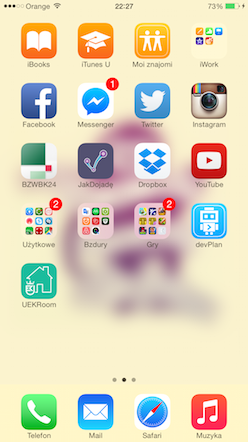

Po uruchomieniu aplikacji na ekranie urządzenia pojawi się **ekran startowy** (splash screen):

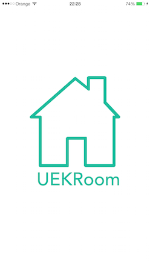

#### Logowanie oraz rejestracja

Każdorazowe uruchomienie aplikacji zobowiązuje użytkownika do **zalogowania się** na wcześniej założonym koncie. Zalogowanie następuje poprzez podanie prawidłowego _loginu_ oraz _hasła_, które są zapisywane w pamięci `localStorage`.

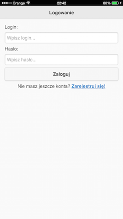

W przypadku podania **błednego** loginu lub hasła oczom użytkownika pojawi się okno dialogowe informujące o tym fakcie. Również w przypadku, kiedy w aplikacji nie ma zapisanych infrmacji o żadnym użytkownik wyświetlony zostanie odpowiedni komunikat informujący o tym fakcie.

Naciśnięcie pola: 
>Nie masz jeszcze konta? **Zarejestruj się!**

przeniesie użytkownika do nowego ekranu, w którym będzie mógł stworzyć nowe konto umożliwiające mu korzystanie z aplikacji.
Podobnie jak w przypadku ekranu logowania, użytkownik musi podać _login_ oraz _hasło_, które będą wykorzystywane do jego weryfikacji.

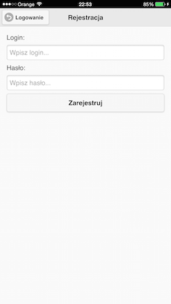

Jeżeli użytkownikowi uda się zalogować lub w przypadku nowego użytkownka - zarejestrować, to automatycznie zostanie przeniesiony do **głównego okna aplikacji**.

#### Wyszukiwanie wolnych sal

Główny ekran aplikacji służy do wyszukiwania wolnych sal dla podanych kryteriów, którymi są:

- **Dzień początkowy**.
- **Dzień końcowy**.
- **Dale wykładowe na terenie Krakowa** (odhaczenie tej opcji będzie również wyszukiwało sal w ośrodkach zamiejscowych).
- **Uwzglednienie laboratoriów komputerowych** w wynikach wyszukiwnia.
- **Grupa dziekańska, przedmiot do wyboru lub lektorat**.

Ekran ten prezentuje się w następujący sposób:

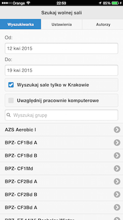

Zakres dat, w którym szukane będą wolne sale określany jest przy użyciu natywnego rozwiązania (_datepicker_), które wbudowane jest w każdy system operacyjny wspierany przez **UEKRoom**. Wybór ten przedstawia poniższy zrzut ekranu:

Kolejne dwie opcje filtrowania sal dostępny są przy użyciu _checkbox_'ów, a ich działanie jest następujące:

- **Wyszukaj sale tylko w Krakowie** - jeżeli ta opcja jest zaznaczona, aplikacja będzie wyszukiwała sal dostępnych wyłącznie na terenie miasta Kraków. Odznaczenie tej opcji spowoduje zwiększenie obrębu wyszukiwnia dostępnych sal również do **ZOD** (Zamiejscowych Ośrodków Dydaktycznych).
- **Uwzględnij pracownie komputerowe** - zaznaczenie tej opcji pozwoli aplikacji dołączyć do wyników wyszukiwania sal również te, ktore są laboratoriami komputerowymi.

Ostatnim komponentem służącym do określania kryteriów wyszukiwania jest grupa, dla której stworzona ma być lista dostępnych sal. Przy pierwszym uruchomieniu aplikacji lista ta musi zostać pobrana z serwera **KN >DEV**, a następnie jest ona zapisywania w pamięci `localStorage` dzięki czmeu nie musi ona być pobierana kolejny raz. Lista grup działających przy UEK w Krakowie liczy ok. 4000 rekordów, więc pobranie i przetworzenie ich wszystkich może spowodować pewne problemy dla aplikacji hybrydowej w zwiazku z czym użytkownik zostanie poinformowany o fakcie pobierania grup poprzez następujący ekran:

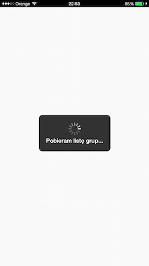

Kiedy grupy zostaną pobrane, przetworzone oraz zapisane do pamięci `localStorage` użytkownik może prześć do łatwego filtrowania poprzez wpisane początkowych znaków grupy, dla której chce otrzymać wyniki wyszukiwania. Poniżej przedstawiono przykładowy zrzut ekranu z wyszukiwania grupy przy użyciu ciagu znaków `Krduis`:

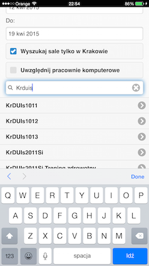

W celu wyświetlenia dostępnych sal dla określonych kryteriów wyszukiwania użytkownik musi nacisnąć na komórkę z grupą, dla które wysłanie takiego zapytania ma sie odbyć. Naciśnięcie komórki spowoduje przesłanie odpowiedniego zapytania do serwera, o tym fakcie użytkownik zostanie powiadomiony poprzez komponent ładowania podobny do tego, który został wyświetlony w przypadku pierwszego pobrania listy grup z serwera. Po pomyślnym zakończeniu tej operacji użytkownik automatycznie zostanie przeniesiony do widoku, w którym będzie mógł zobaczyć wyniki tego zapytania. Jeżeli urządzenie nie ma aktualnie dostępu do sieci internet (WiFi lub GSM) użytkownik zostanie o tym fakcie poinformowany odpowiednim komunikatem. Do sprawdzenia połączenia wykorzystywany jest plugin [Network Information](http://plugins.cordova.io/#/package/org.apache.cordova.network-information).

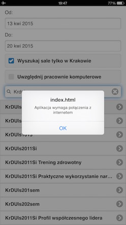

#### Widok kalendarza z wolnymi salami

Określenie wszystkich parametrów zapytania oraz naciśniecię na komórkę z grupą spowoduje, że na ekranie urządzania pojawi się **kalendarz tygodniowy** z zaznaczonymi wolnymi salami oraz z godzinami, w których określona grupa nie posiada zajęć. Widok tygodniowy oferuje przejrzysty format danych, dzięki czemu w łatwy sposób można na nim znaleźć interesujące wydarzenia.
W przypadku wyboru zakresu czasu dłuższego niż jeden tydzień, użytkownik może zmienić zestaw wyświetlanych danych poprzez naciśnięcie odpowiedniego przycisku **Następny** lub **Poprzedni**.

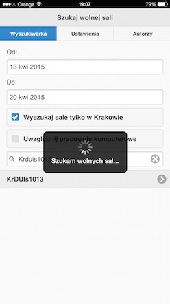 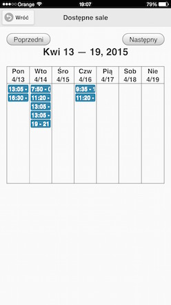

Użytkownik może przeprowadzać pewne interakcje z kalendarzem, a mianowiecie może on nacisnąć na konkretne wydarzenie odnotowane w kalendarzu, co spowoduje wyświetlenie okna `popup` wraz z listą dostępnych sal w określonej godzienie oraz terminie, co przedstawia poniższy zrzut ekranu:

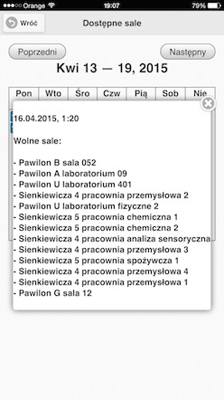

#### Zakładka ustwienia

Nawigacja wewnątrz aplikacji odbywa się z wykorzystaniem komponentu frameworka **jQuery Mobile**, który nazywa się [`navbar`](https://demos.jquerymobile.com/1.2.0/docs/toolbars/docs-navbar.html). Dzięki niemu użytkownik może w łatwy sposób przełączać się pomiędzy poszczególnymi stronami aplikacji.
Strona, która zostanie omówiona w tym podrozdziale dotyczy **ustawień** aplikacji oraz przedstawienia możliwości natywnych rozwiązań wewnątrz frameworka **Cordova**.

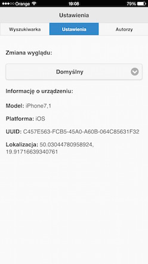

Omawiana zakładka pozwala na dwie rzeczy:

- Zmiana **stylu** kolorystycznego aplikacji.
- Podgląd **informacji o urządzeniu**, na którym aplikacja została uruchomiona oraz podgląd **współrzędnych geograficznych**, w których znajduje się urządzenie.

Pierwsza funkcjonalność pozwala w łatwy sposób zmienić domyślny (szary) schemat kolorów aplikacji na schemat ciemny (grafitowy/czarny).

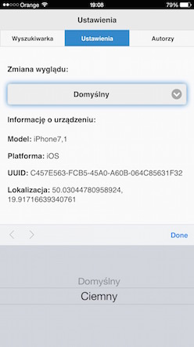 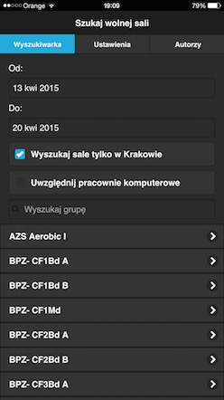

**Informacje o urządzeniu** są wyświetlane przy użyciu pluginu [Device](http://plugins.cordova.io/#/package/org.apache.cordova.device). W sród nich można znaleźć informacje takie jak: **model urządzenia**, **platforma** (system operacyjny) czy numer **UUID** urządzenia.
Dodatkową informacją, która jest wyświetlana wraz z iformacjami o urządzeniu jest bieżąca lokalizacja geograficzna urządzenia. Funkcjonalność ta realizowana jest przy pomocy pluginu [Geolocation](http://plugins.cordova.io/#/package/org.apache.cordova.geolocation).

#### Zakładka autorzy

W zakładce tej zaprezentowana jest jedynie lista autorów aplikacji. 

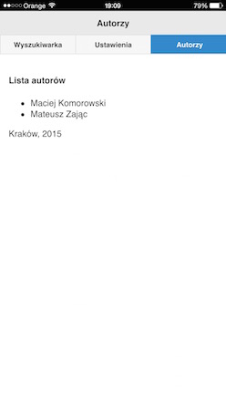